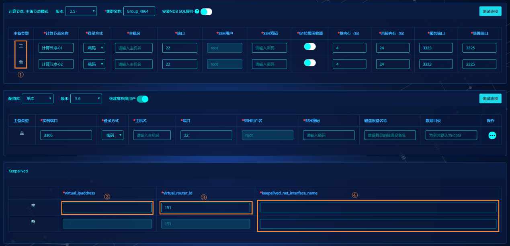
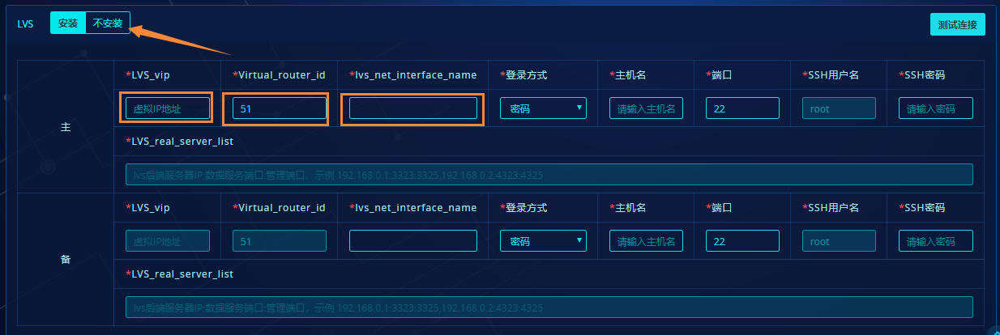
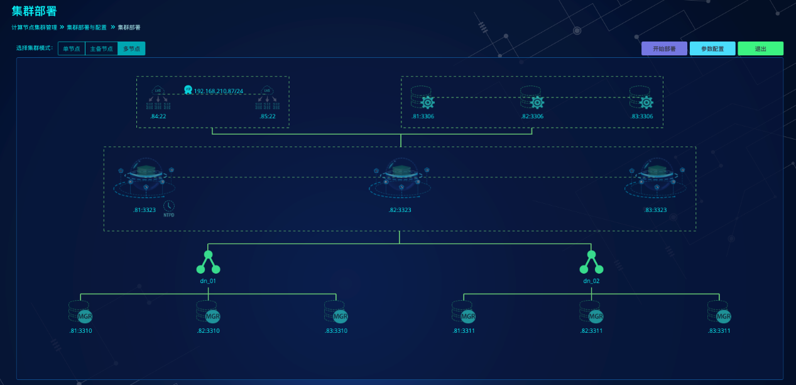
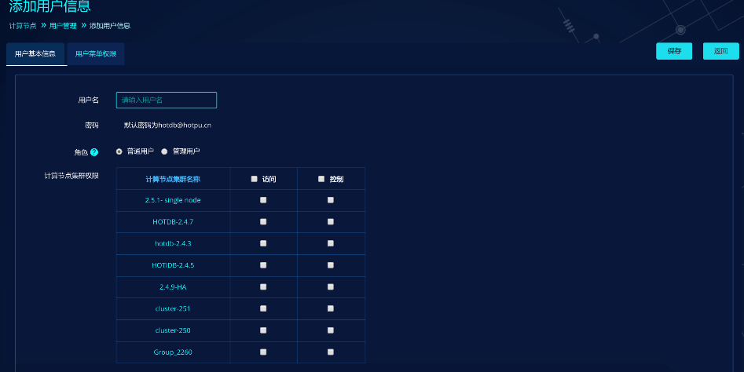
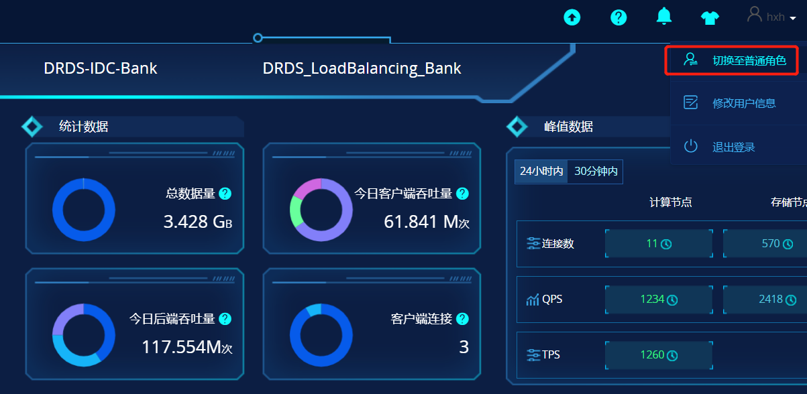
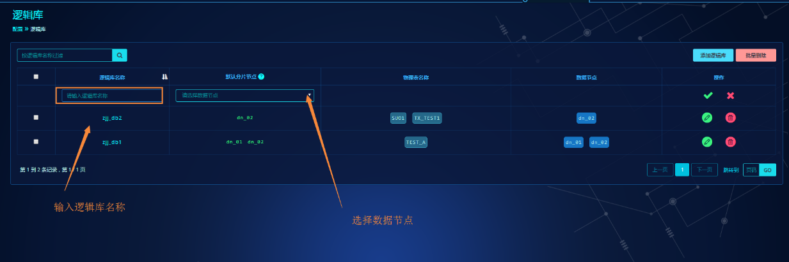
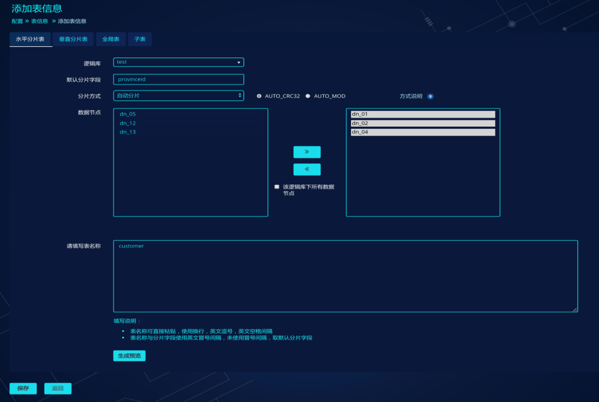
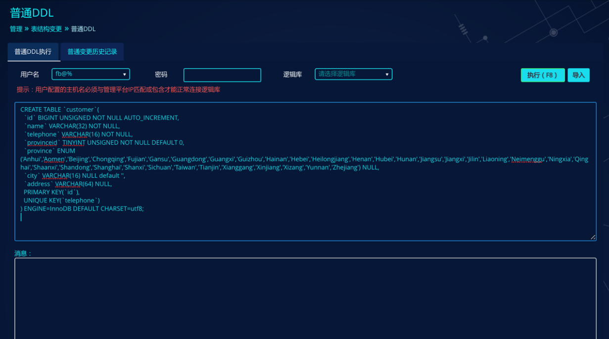
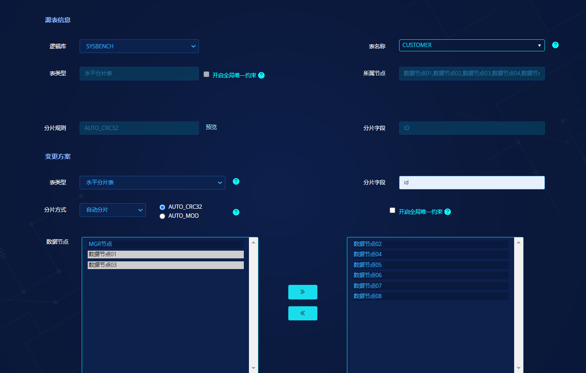

# 快速上手指南

## 快速使用说明

本文档针对快速安装部署和快速使用进行简化说明，包含：

- 快速安装部署
- 快速配置和使用

详细功能体验需要查阅具体对应文档。

## 快速安装部署

> !!!INFO
> 
> 
> 仅针对自动化部署进行说明，如需手动部署需要参考[安装部署](install-and-deploy.md)文档。

### 硬件资源参考

> !!!INFO
> 
> 仅针对功能测试使用虚拟机情况，生产环境或开发测试环境等需要参考[硬件配置推荐](hardware-config-recommendation.md)文档。

| 服务器用途 | 服务器配置 | 服务器数量 |
|----------------------|---------------------------------|----------------|
| HotDB Server计算节点 | CPU：12核  内存：24G  磁盘：200G  网络：千兆 | 2台HA或3台Cluster |
| HotDB Management管理平台 | CPU：8核  内存：24G  磁盘：200G  网络：千兆 | 2台 |
| HotDB Engine 数据源存储节点 | CPU：8核  内存：32G  磁盘：500G  网络：千兆 | 2台起步 |

### yum源检测

执行以下命令，确认yum源完整。

```bash
yum -y install grep procps coreutils initscripts xfsprogs util-linux-ng e2fsprogs libselinux-utils chkconfig wget yum-utils gawk man libaio perl perl-DBD-MySQL cronie xz numactl sysstat screen iotop unzip cpuspeed cpupowerutils irqbalance ethtool net-tools hdparm iproute lrzsz dos2unix glibc glibc.i686 usbutils telnet psmisc policycoreutils-python selinux-policy dstat mcelog
```

### 部署管理平台

登录管理平台服务器，将一键部署安装包上传至服务器，并解压到指定目录。

```bash
mkdir /usr/local/hotdb
tar -zxvf auto_hotdbinstall_HotDB2.*.tar.gz -C /usr/local/hotdb/
```

执行安装脚本安装管理平台。

```bash
cd /usr/local/hotdb/Install_Package/
sh hotdbinstall_v*.sh --ntpdate-server-ip=182.92.12.11 --mysql-version=5.7 --hotdb-config-port=3316 --hotdb-version=2.5 --install-hotdb-server-management=yes
```

查看安装日志获取安装进度。

```bash
tail -f /usr/local/hotdb/Install_Package/hotdbinstall.log
```

日志打印如下标记则为安装成功正常结束。

```
[INFO] hotdbinstall finished without error, but you should check if there is any warnings
```

启动管理平台。

```bash
## sh /usr/local/hotdb/hotdb-management/bin/hotdb_management start
```

浏览器打开管理平台。

启动成功后，打开浏览器输入：`http://服务器的IP地址:3324/page/index.html`，成功打开页面后登录账号到管理员界面。（管理员用户名密码默认为 admin/admin）

### 部署数据库集群

> !!!INFO
> 
> 本次以"多节点"模式的集群部署为例，展示集群部署中的完整过程以及对应说明。

#### 添加集群部署任务

admin用户登录管理平台后进入"集群管理->计算节点集群"，点击【集群部署】按钮进入集群部署功能页面。


#### 选择部署的集群模式

集群分为单节点、主备节点、多节点三种模式，选择多计算节点集群模式后点击【参数配置】按钮进入集群部署参数配置页面。


**集群模式说明：**

- 单节点：单节点指整个集群中只有一个计算节点的集群模式。无需安装Keepalived或LVS等高可用组件。


- 主备节点：主备模式也称HA模式，即通过Keepalived组件进行高可用搭建的集群模式。在集群中存在主、备两个计算节点。



1. 主备节点模式的集群，需要填写2台服务器的配置信息。
2. Keepalived的virtual_ipaddress（简称VIP）要求为没有被服务器或其他应用所占用且和计算节点服务器在相同网段上。格式为VIP+子网掩码长度，例：192.168.200.120/24。
3. virtual_router_id的值可自行在范围【1-255】选定一个值，但该值要求在集群使用的网段内是唯一的，即不与其他应用服务选择的值冲突。
4. 主备Keepalived服务器网关设备名称是Keepalived所在服务器的网卡设备名称，该名称必须填写正确，格式为网卡名称+ :1 例："eth0:1"。（网关设备名称可通过`ip a`命令查看）

- 多节点：多节点模式也叫作负载均衡模式，是通过LVS组件或其他负载均衡组件来控制分发业务流量到集群中的多个计算节点上的一种架构模式。多节点模式中计算节点个数不能低于3个或超过9个。


1. 多节点模式中，计算节点个数默认为3个，且计算节点版本必须为2.5。
2. 集群网段为计算节点安装服务器所在网段，格式为：网段+子网掩码长度，例：192.168.200.0/24。
3. 通信端口为集群内各计算节点进行通信时所用端口，默认为3326.无特殊要求时不建议修改。
4. LVS是多节点模式中实现负载均衡的组件，也可以关闭【安装】选择其他负载均衡方式代替LVS。
5. LVS_vip为LVS组件中所配置的虚拟IP地址（简称VIP），要求必须为没有被服务器或其他应用所占用且和计算节点服务器在相同网段上。格式为VIP+子网掩码长度，例：192.168.200.120/24。
6. virtual_router_id的值可自行在范围【1-255】选定一个值，但该值要求在集群使用的网段内是唯一的，即不与其他应用服务选择的值冲突。
7. lvs_net_interface_name是LVS组件所在服务器的网卡名称，该名称必须填写正确，格式为网卡名称+ :2 例："eth0:2"。（网关设备名称可通过`ip a`命令查看）。

#### 集群部署参数配置

1. **计算节点参数**

以下将以计算节点集群模式为多节点为例介绍计算节点的参数配置。


1. 计算节点个数默认为3，设置时不能小于3或大于7个。
2. 集群名称会自动生成，格式为：Group+四位随机数，可根据实际情况修改。
3. 可根据实际需要查看是否要安装NDB SQL服务，如果安装则要求计算节点版本必须大于等于V2.5.2。
4. 集群网段为计算节点所在服务器的网段范围，格式为：网段+子网掩码长度，例：192.168.200.0/24。
5. 通信端口为集群内各计算节点进行通信时所用端口，默认为3326，无特殊要求不建议修改。
6. 计算节点名称会自动生成，格式为：计算节点+编号,可根据实际情况修改。
7. 登录方式为管理平台连接部署目标服务器的方式，默认使用"密码"方式登录，如果使用"免密"方式则要求管理平台服务器与目标部署服务器之间需要打通免密通道，具体实现方式可参照[实现免密登录说明](install-and-deploy.md#实现免密登录说明)。
8. 当"登录方式"为"密码"方式时需要输入连接目标服务器的SSH信息包括：SSH用户、SSH密码。端口号默认为22，无特殊要求一般无需修改。
9. 堆内存默认为4G，当设置大于8G时，会提示要求开启"G1垃圾回收器"。该参数输入范围【1-64】G。
10. 直接内存默认为24G，参数输入范围【1-64】G。
11. 服务端口与管理端口默认为"3323,3325"，无特殊要求可直接使用默认值。若修改且安装成功后计算节点的server.xml配置文件对应参数也会同步修改。
12. 点击【测试连接】可测试目标服务器的连接是否正常，判断输入的SSH信息是否可用。

#### 配置库参数


1. 安装的配置库实例可选择模式有：单库、双主、MGR，以选择MGR模式为例。
2. 配置库版本会因模式而变动，选择MGR模式时版本必须为5.7，选择其他模 式时可选择5.6或5.7的MySQL实例版本。
3. 选择MGR模式时可编辑MGR模式下的实例数量，默认3个，编辑时不能少于3个或大于9个。选择其他模式则无数量限制。
4. 创建高权限用户开关，开关默认打开即配置库MySQL实例安装成功后会默认生成一个"hotdb_root"的账户，该账户拥有MySQL实例的所有权限。
5. 实例端口号默认为3306，可根据实际情况自行修改。
6. "磁盘设备名称"与"数据目录"参数为选填项，为空时程序会自动为"磁盘设备名称"赋予空值，"数据目录"赋予默认值"/data"。关于参数详细说明，可参照[集群部署脚本参数说明](install-and-deploy.md#脚本参数说明)。
7. 【更多参数】可为当前部署的MySQL实例设置更多选项参数，当参数的输入框为空时安装脚本会自行计算处理并给予默认值，无特殊要求时不建议修改。若需要使修改的参数适用到其他部署的配置库实例上可勾选"更多参数同步到其他配置库实例中"选项。

#### LVS参数



1. 集群部署支持不安装LVS相关组件，当选择到不安装时，则不需要填写LVS配置参数
2. LVS_vip填写的IP，要求必须为没有被服务器或其他应用所占用的且和计算节点服务器在相同网段上。格式为VIP+子网掩码长度，例：192.168.200.120/24
3. virtual_router_id的值可自行在范围【1-255】选定一个值，但该值必须在集群使用的网段内是唯一的，即没有与其他服务程序选取的值冲突。
4. 主备lvs_net_interface_name是LVS所在服务器的网关设备名称，该名称必须与实际服务器上显示的一致（可通过 ip a命令查看）,格式为：网关设备名称+ ":2" 例如：`eth0:2`。

#### 存储节点参数


1. 存储节点的版本可选择"5.6、5.7"，默认为5.7。
2. 节点个数为集群中的数据节点个数，设置时不能超过128。
3. 节点类型为数据节点下关联的存储节点复制关系类型包含：单库、主从、双主、MGR。
4. 点击【生成】按钮可快速按照选填写的参数生成存储节点配置信息。
5. "创建高权限用户"请参照配置库该处说明。
6. "节点名称"为数据节点名称，默认根据"节点个数"自动生成，用户可自行修改。
7. "存储节点类型"默认根据选择的"节点类型"进行生成。例："节点类型"为"主从"，则在每个数据节点下分别生成一个"主库"、一个"从库"类型的存储节点记录。
8. "安装监听程序"开关默认打开，即在存储节点所在服务器上安装HotDB Listener组件。安装监听程序可用于解决计算节点集群模式的性能线性扩展问题。若用户暂不使用监听程序，可手动关闭。
9. "监听端口"即监听程序启动端口，默认值为3330，可手动修改。一个存储节点服务器上部署一个监听程序需要配置一个未被占用的端口作监听端口。一个存储节点服务器下仅支持通过集群部署部署一个监听程序，即同一个主机名只能对应配置同一个监听端口。若关闭"安装监听程序"，会联级置灰"监听端口"，不可编辑。
10. "监听程序服务端口"即计算节点通过监听程序连接存储节点的端口，默认值为4001，若一个监听程序需要监听多个存储节点，则需要为其分别填写不同的服务端口。若关闭"安装监听程序"，会联级置灰"监听程序服务端口"，不可编辑。
11. "安装备份程序"开关默认打开，即在存储节点所在服务器上安装HotDB Backup备份程序。
12. "关联管理平台IP"，默认填充当前执行集群部署任务的管理平台地址。该地址为备份程序启动时需要指定所服务的管理平台地址。
13. 点击操作中的"增加"、"删除"可新增或去除一行存储节点配置记录。
14. 存储节点数量过多时可考虑使用"导入"方式进行配置。导入前须先下载模板，再按照模板说明进行填写配置信息，完成后再导入管理平台中。若填写有误时，程序会显示导入失败与失败详细信息。

#### 时间同步参数设置


1. 时间同步主要是为集群所有服务器指定NTP时间服务地址，保证集群中的服务器时间保持一致。
2. 默认在主计算节点或多节点中的第一个计算节点所在服务器上安装NTP服务程序。若集群中已有可用的NTP服务，则可取消安装。
3. 集群中其他服务器时间同步地址默认指向已安装有NTP服务器的计算节点服务器地址，若计算节点不安装NTP服务器则其他服务器与计算节点服务器所指向的时间同步地址保持一致。

Tips: 在实际应用场景中，除了软件方面的时钟同步配置以外，还需要关注硬件时钟是否同步，可使用hwclock查看（一般在虚拟机环境中存在差异的可能性较大）。

#### 参数校验并保存


1. 仅保存：点击【仅保存】按钮，程序不会验证配置参数输入的合法性和完整性，仅校验必填项是否已填写。
2. 检查并保存：点击【检测并保存】按钮，程序会校验配置参数的合法性和完整性，并发送安装部署包到目标服务器上以验证是否符合集群部署的硬件要求，不符合要求时会弹窗提示。**开始部署前的集群都必须通过【检测并保存】才能进入安装环节**。
3. 若集群配置参数检测未通过，需要根据报错情况进行相应的修改，然后再进行校验。
4. 如果因为服务器硬件配置不满足要求导致未通过检测的，建议先将配置参数通过【仅保存】按钮先保存下来，然后根据提示调整目标服务器的硬件配置或更换目标服务器，然后再进行校验。


5. 已保存但未开始安装的集群在"集群管理"页面显示时是未开启监控的，且集群部署信息各栏信息显示"已配置"字样。



6. 已保存但未开始安装的集群，通过"部署拓扑"按钮进入后，显示如上图所示。虚线图标代表已配置好但未开始安装的组件。

#### 开始部署


1. 点击【开始部署】进入安装进程，若未通过校验的集群点击【开始部署】则提示不允许进入部署。
2. 通过部署进度条查看当前部署状态。
3. 部署日志会实时输出到控制台中，总控制台可查看所有服务器部署完成情况。具体每台服务器控制台可单独查看对应服务器部署时的脚本执行日志信息。
4. 可点击右上角放大按钮，全屏查看。
5. 安装完成后可在总控制台中看到"集群部署成功"字样。

#### 部署完成


1. 部署成功的集群在"集群管理"页面中会自动开启监控，"集群部署信息"各栏显示各组件的运行状态信息。
2. 点击【部署拓扑】按钮进入部署拓扑图页面可查看到拓扑图中的图标都变成实线。

#### 添加管理平台用户

管理平台用户是管理、配置、监控、检测计算节点集群的用户,它有两种权限，一种为访问权限（只能查看部分页面），一种为控制权限（可编辑操作）。

管理员在创建管理平台用户时将计算节点集群分配给管理平台用户，同时分配控制权限，创建成功后，以管理平台用户登录，就可以管理、配置、监控计算节点集群了。

登录管理平台，在管理平台用户页面点击 "添加新用户" 输入用户名称，分配计算节点集群的控制权限。添加完成后，该用户登录后可以对计算节点进行管理。



使用新用户登录管理平台后，管理角色用户默认登录管理页面首页，普通用户默认登录数据库集群管理首页，管理角色可通过右上角角色切换跳转至数据库集群管理页面。



## 快速配置HotDB Server

本节将描述通过可视化管理平台进行快速配置分布式事务数据HotDB Server的方法，用于达到快速入门的目的。如果需要了解更多的配置功能以及命令行配置方式，请参考《分布式事务数据库HotDB Server【管理平台】功能使用手册》和《分布式事务数据库HotDB Server-v2.5.6【标准】功能使用手册v1.0》。

在下面的例子中，将配置一张"customer"水平分片表，从属于"test"的逻辑库，实际分布在3个节点，分片字段为"provinceid"，分片规则为自动分片。

### 添加逻辑库

通常在MySQL中create database 创建的数据库称为"逻辑库"，一个"逻辑库"可以为一个应用或一个微服务提供数据库服务。为了保持一致性，分布式事务数据库系统同样通过"逻辑库"为一个应用或一个微服务提供数据库服务，但是分布式事务数据库系统由多套MySQL实例组成，所以在HotDB Server中"逻辑库"是"全局逻辑库"，即多套MySQL实例中"逻辑库"的集合，在HotDB Server中仍称为逻辑库。逻辑库是计算节点中的虚拟数据库，用MySQL命令登录计算节点后，通过如下语句显示逻辑库列表：

show databases;

登录管理平台页面，选择"配置"->"逻辑库"->[添加逻辑库](#添加逻辑库)，输入"test"逻辑库名称，点击"**√**"，保存配置，逻辑库即添加成功。



在页面右上角中点击云朵标志的"动态加载"，若页面提示"动态加载成功"，则配置信息在计算节点中已经成功生效。

### 赋予用户逻辑库权限

只有被赋予逻辑库权限的用户才能使用逻辑库。

登录管理平台页面，选择"配置"->"数据库用户管理"，选择root用户，并点击"编辑"按钮。跳转到"编辑用户权限"页面，在下拉框中勾选创建好的逻辑库"test"，点击"保存"，权限赋予成功。

> !!!NOTE
> 
> 管理平台安装后，系统默认创建一个平台用户root（密码root）。

全局权限说明：全局权限代表对当前集群的所有库表的权限，如果只需要针对部分逻辑库或者逻辑库部分表权限的话，请使用"逻辑库权限"、"表权限"单独添加，且权限不会随着逻辑库或表的删除而消失。

super权限说明：针对需要使用数据库管理端口（3325）的权限，如通过管理平台执行在线表结构变更、查询数据库状态等，一般数据库用户无需此权限。


在页面右上角中点击云朵标志的"动态加载"，若页面提示"动态加载成功"，则配置信息在计算节点中已经成功生效。

### 添加表信息

登录管理平台页面，选择"配置"->"表信息"->[添加表信息](#添加表信息)


根据业务场景，选择表类型后输入配置参数，在此例子中，在水平分片表页面下，添加参数配置如下：



- 逻辑库：下拉菜单中选择上节添加的[逻辑库](#添加逻辑库)test。
- 默认分片字段：在填写表名称时，表名称与其对应的分片字段应使用英文冒号间隔，若未填写分片字段，则取默认分片字段。所以此处填写"provinceid"
- 分片方式：在此例子中，选择自动分片
- 数据节点：选择分片的数据节点
- 请填写表名称：输入"customer"，添加多表但不同分片字段时，可以输入"customer:provinceid"表示。

点击【保存】，成功添加customer自动分片表。

> !!!NOTE
> 
> 该表引用的分片规则是AUTO_CRC32类型(AUTO_MOD 与 AUTO_CRC32分片类型区别可查看页面中的"方式说明")。

在页面右上角中点击云朵标志的"动态加载"，若页面提示"动态加载成功"，则配置信息在计算节点中已经成功生效。

### 校验并动态加载配置信息

登录管理平台页面，对计算节点数据库用户，逻辑库，数据节点，存储节点，故障切换，分片规则，表信息，子表信息做的任何修改，都需要进行"动态加载"，新的配置信息才能生效。

若计算节点未启动，将不能执行动态加载，因此需先启动计算节点。

登录管理平台页面，选择"配置"->"配置校验"，在页面中点击"开始校验"，若没有出现配置错误的提示，则表示配置信息无误。

在页面中点击"动态加载"，若页面提示"动态加载成功"，则配置信息在计算节点中已经成功生效：


### 登录计算节点并开始使用

使用MySQL命令行，指定安装部署时的VIP地址或者计算节点IP（如果未安装VIP情况），登录到计算节点：

```bash
mysql -uroot -proot -h192.168.210.97 -P3323 -Dtest
```

例如：

```
root> mysql -h192.168.210.97 -uroot -proot -P3323 -Dtest
mysql: [Warning] Using a password on the command line interface can be insecure.
Welcome to the MySQL monitor. Commands end with ; or \\g.
Your MySQL connection id is 100728
Server version: 5.7.19-HotDB-2.5.2 HotDB Server by Hotpu Tech
Copyright (c) 2000, 2018, Oracle and/or its affiliates. All rights reserved.
Oracle is a registered trademark of Oracle Corporation and/or its
affiliates. Other names may be trademarks of their respective
owners.
Type 'help;' or '\\h' for help. Type '\\c' to clear the current input statement.
mysql>
```

执行customer的建表语句：

```sql
CREATE TABLE `customer`(
  `id` BIGINT UNSIGNED NOT NULL AUTO_INCREMENT,
  `name` VARCHAR(32) NOT NULL,
  `telephone` VARCHAR(16) NOT NULL,
  `provinceid` TINYINT UNSIGNED NOT NULL DEFAULT 0,
  `province` ENUM ('Anhui','Aomen','Beijing','Chongqing','Fujian','Gansu','Guangdong','Guangxi','Guizhou','Hainan','Hebei','Heilongjiang','Henan','Hubei','Hunan','Jiangsu','Jiangxi','Jilin','Liaoning','Neimenggu','Ningxia','Qinghai','Shaanxi','Shandong','Shanghai','Shanxi','Sichuan','Taiwan','Tianjin','Xianggang','Xinjiang','Xizang','Yunnan','Zhejiang') NULL
  `city` VARCHAR(16) NULL default '',
  `address` VARCHAR(64) NULL,
PRIMARY KEY(`id`),
UNIQUE KEY(`telephone`)
) ENGINE=InnoDB DEFAULT CHARSET=utf8;
```

计算节点将在各个数据节点创建customer表。可以登录到各个MySQL存储节点上，验证customer是否已经被创建。

或在管理平台"配置"->"表信息"页面，找到上节添加的[表配置](#添加表信息)，在表结构一列中点击【未创建】跳转到普通DDL页面。


输入[数据库用户名密码](#赋予用户逻辑库权限)，并选择test逻辑库后，输入建表语句，点击【执行】添加表结构。



分片表customer创建成功后，可以连接计算节点执行下面的SQL语句，操作数据：

```sql
INSERT INTO customer VALUES (21,'何重庆','13912340021',4,'Chongqing','重庆','某某街某某号');
INSERT INTO customer VALUES (22,'吕重庆','13912340022',4,'Chongqing','重庆','某某街某某号');
INSERT INTO customer VALUES (25,'孔福州','13912340025',5,'Fujian','福州','某某街某某号');
INSERT INTO customer VALUES (26,'曹兰州','13912340026',6,'Gansu','兰州','某某街某某号');
INSERT INTO customer VALUES (67,'岑南昌','13912340067',17,'Jiangxi','南昌','某某街某某号');
INSERT INTO customer VALUES (68,'薛长春','13912340068',18,'Jilin','长春','某某街某某号');
INSERT INTO customer VALUES (69,'雷沈阳','13912340069',19,'Liaoning','沈阳','某某街某某号');
INSERT INTO customer VALUES (70,'贺呼和浩特','13912340070',20,'Neimenggu','呼和浩特','某某街某某号');
INSERT INTO customer VALUES (71,'倪银川','13912340071',21,'Ningxia','银川','某某街某某号');
INSERT INTO customer VALUES (72,'汤西宁','13912340072',22,'Qinghai','西宁','某某街某某号');
INSERT INTO customer VALUES (73,'滕西安','13912340073',23,'Shaanxi','西安','某某街某某号');
INSERT INTO customer VALUES (74,'殷济南','13912340074',24,'Shandong','济南','某某街某某号');
INSERT INTO customer VALUES (93,'顾台北','13912340093',28,'Taiwan','台北','某某街某某号');
INSERT INTO customer VALUES (94,'孟天津','13912340094',29,'Tianjin','天津','某某街某某号');
INSERT INTO customer VALUES (95,'平香港','13912340095',30,'Xianggang','香港','某某街某某号');
INSERT INTO customer VALUES (96,'黄乌鲁木齐','13912340096',31,'Xinjiang','乌鲁木齐','某某街某某号');
INSERT INTO customer VALUES (99,'萧杭州','13912340099',34,'Zhejiang','杭州','某某街某某号');
INSERT INTO customer VALUES (100,'尹杭州','13912340100',34,'Zhejiang','杭州','某某街某某号');
```

也可对customer分片表执行DELETE、UPDATE、SELECT等操作。

### 修改表分片方案

如果出现表已经创建情况下，想要变更数据节点数量、表类型、分片规则、分片字段等情况，可以使用管理分片方案在线变更功能进行在线表修改及数据重均衡。

登录管理平台页面，选择"管理"->"分片方案在线变更"->"发起变更任务"


填写变更方案并进行下一步检测，预检测通过后，选择是否规避业务高峰期、旧表数据保留时间等，即可直接进行变更。



